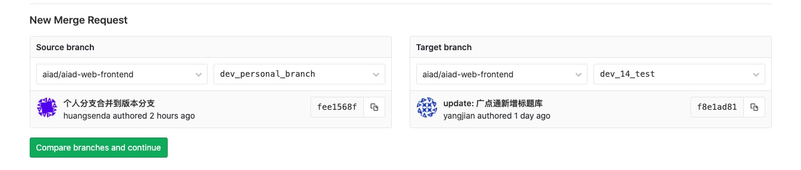
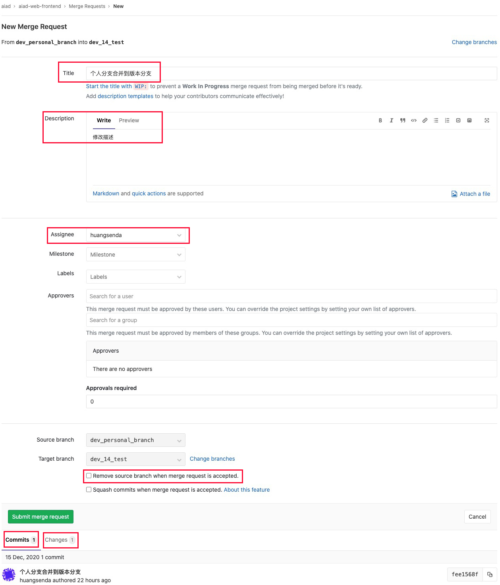
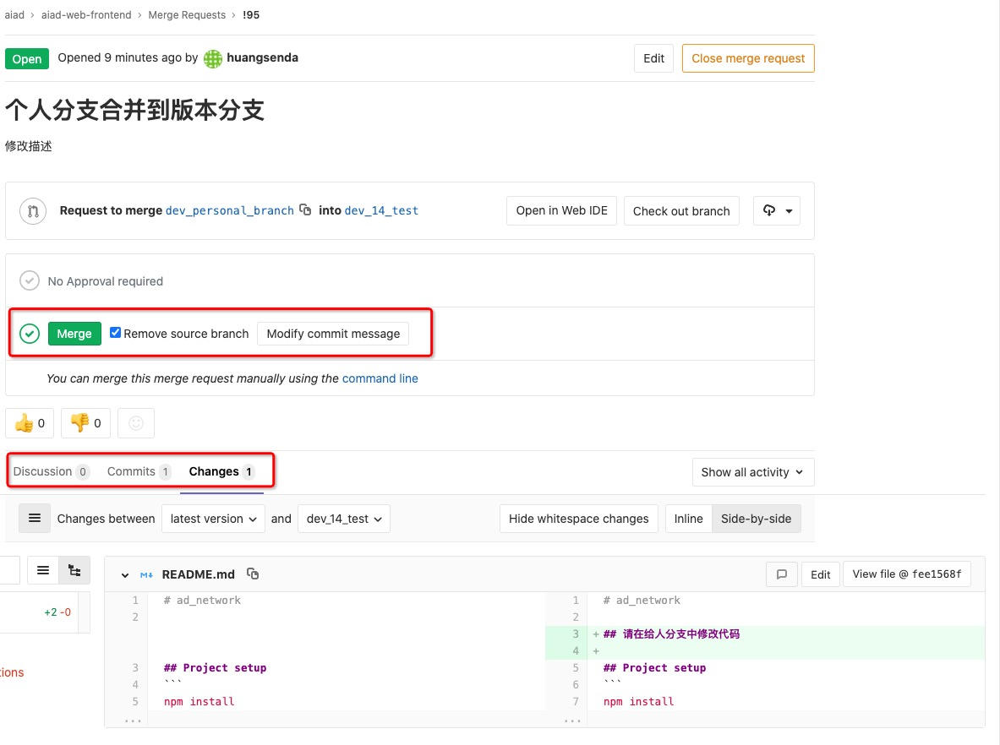
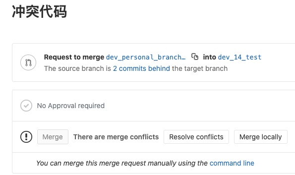

# Git操作说明

> git 仓库提交合并操作流程,避免合并冲突或代码丢失，以及方便进行 code review

##### 注意：1.master 和版本分支上绝对不能直接进行操作; 2.使用小乌龟可以只看文字和图片部分，不用看命令行

## 正常操作流程
#### 1.获取当前版本分支
每次版本迭代都会在 master 的基础上新建一个当前版本的分支，如 dev_14_test

```bash
git pull dev_14_test
```

#### 2.从版本分支创建个人分支
任何代码的修改都不能在版本分支上操作，必需得基于版本分支创建个人分支

```bash
git checkout -b dev_personal_branch
```

#### 3.代码修改与提交
在个人人分支上就修改完成代码后将个人分支推到远端库中，在远端库中与版本分支进行合并请求

###### # 如果是首次推到远端，执行以下代码
```bash
git push --set-upstream origin dev_personal_branch
```
###### # 如果已经推到远端则直接push
```bash
git push
```

#### 4.远端GitLab操作
- 提交后到远端进行合并操作，进入到 GitLab 页面，左侧菜单中选择 Merge Requests，选择右上角绿色按钮 ‘New merge request’，进入到下图页面，左侧为个人修改的分支，右侧选择被合并的目标分支，然后点击 Compare branches and continue 按钮


- 进入到合并请求提交页确认合并信息
##### # Title：填写修改代码的标题
##### # Description：修改描述
##### # Assignee：提交人
##### # Source branch：想要合并的个人分支
##### # Target branch：被合并的目标分支
##### # Remove source branch when merge request is accepted：合并后在远端移除个人分支(建议勾选，避免远端分支过多)
##### # Commits：查看合并的 commits log
##### # Changes：查看合并的代码修改，方便进行 code review



- 合并信息确认后点击按钮 Submit merge request 进入合并确认页
##### # 如果先前没有勾选 Remove source branch when merge request is accepted，该页也可以选择勾选 Remove source branch
##### # Discussion：其他开发者可以对本次合并请求进行评价
##### # Commits：检查合并的commits log
##### # Changes：检查合并的代码变更，在合并前最重要的步骤，查看所有修改代码



- 全部确认无误后点击绿色按钮 Merge 合并分支

---

## 异常情况

很多情况下都会导致合并冲突，比如两个分支中同时修改了一段代码，或者 commits 错乱等
一下情况是两个分支同时修改了同一段代码导致冲突

此处我在 dev_14_test 上新建的个分支 dev_personal_branch_err，修改了刚刚 dev_personal_branch 分支上同一段代码并提交
```bash
    git checkout dev_14_test
    git checkout -b dev_personal_branch_err
```



此时 Merge 按钮无法点击，阻止错误继续下去，此时有很多方法可以解决冲突，个人比较喜欢用 rebase 的方式解决

##### 首先声明，所以操作都只能是在个人的分支上进行操作

- 第一步是先 copy 个人分支作为备份，以免误操作导致修改代码丢失

```bash
    git checkout dev_personal_branch_err
    git checkout -b copy_dev_personal_branch_err
    git checkout dev_personal_branch_err
```
- 然后我们再回到 dev_personal_branch_err 分支上，基于远端的 dev_14_test 分支就行 rebase 操作
```bash
    git pull --rebase origin dev_14_test
```
- 此时就会显示冲突的情况
```bash
First, rewinding head to replay your work on top of it...
Applying: 冲突代码
Using index info to reconstruct a base tree...
M	README.md
Falling back to patching base and 3-way merge...
Auto-merging README.md
CONFLICT (content): Merge conflict in README.md
error: Failed to merge in the changes.
Patch failed at 0001 冲突代码
The copy of the patch that failed is found in: .git/rebase-apply/patch

Resolve all conflicts manually, mark them as resolved with
"git add/rm <conflicted_files>", then run "git rebase --continue".
You can instead skip this commit: run "git rebase --skip".
To abort and get back to the state before "git rebase", run "git rebase --abort".
```
- 查看 git 状态

```bash
git status
rebase in progress; onto 1ad7cd0
You are currently rebasing branch 'dev_personal_branch_err' on '1ad7cd0'.
  (fix conflicts and then run "git rebase --continue")
  (use "git rebase --skip" to skip this patch)
  (use "git rebase --abort" to check out the original branch)

Unmerged paths:
  (use "git reset HEAD <file>..." to unstage)
  (use "git add <file>..." to mark resolution)

	both modified:   README.md

no changes added to commit (use "git add" and/or "git commit -a")
```

- 说明 README.md 文件有冲突，之后就是前往代码解决冲突，这里就不展示了

- 修改完成后 git add，然后执行 git rebase --continue，如果有多次 commit 提交，会检查每一次 commit 是否有冲突，有可能需要重复解决冲突多次

```bash
    git add README.md
    git rebase --continue
    
    Applying: 冲突代码
```

- 当所有 commits 都 Applying 后，首先要检查代码运行是否正常，是否功能满足需求，然后将目前的 dev_personal_branch_err 分支推到远端，此时需要用到强推，因为变更了原先的该分支的 commit

```bash
    git push origin dev_personal_branch_err -f 
```

此时再到 GItLab 中查看，发现 Merge 按钮 变成可点击状态了

---

## TortoiseSVN（小乌龟）相关操作

小乌龟的相关操作也要符合整套流程

#### 原则
- 对于 master 和版本分支，本地只有 pull 的权限，没有 push 的权限
- 所有代码修改都只能在本地和远端的个人分支上进行修改
- 如果要对其他开发者的分支进行操作，将其他开发者的分支当做 master 或版本分支执行上面相同流程
- 所有合并请求都在远端进行，避免冲突的忽视以及有迹可循
- 在合并前code review ‘Changes’ 中的修改代码是否有明显问题